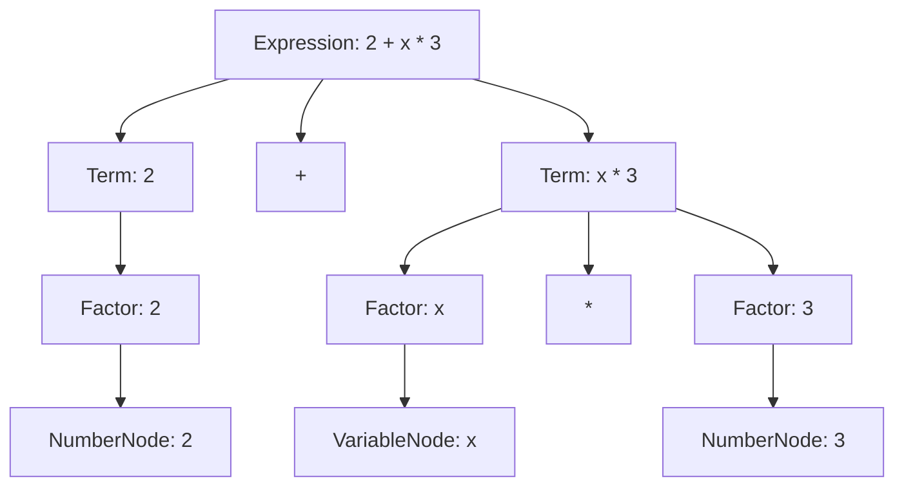

# Abstract Syntax Tree (AST)

This document explains the Abstract Syntax Tree structure used in the Calculus Parser, how it's constructed, and how it represents mathematical expressions.

## Overview

The Abstract Syntax Tree (AST) is a tree representation of the syntactic structure of mathematical expressions. Each node in the tree represents a construct in the expression, such as numbers, variables, operators, or functions.

## AST Node Hierarchy

```
ASTNode (abstract base)
├── ExpressionNode     (complete expressions)
├── TermNode          (terms with * and /)
├── FactorNode        (numbers, variables, functions)
│   ├── NumberNode    (numeric literals)
│   ├── VariableNode  (variables like x, y)
│   └── FunctionNode  (functions like sin, cos)
└── OperatorNode      (operators)
    └── BinaryOperatorNode (binary operators)
        └── AddNode    (addition operations)
```

## Node Types and Structure

### ExpressionNode
Represents a complete expression that can contain multiple terms combined with + and - operators.

**Example:** `2 + 3 * x - 1`
```
ExpressionNode
├── TermNode (2)
├── ADD operator
├── TermNode (3 * x)
├── SUBTRACT operator
└── TermNode (1)
```

### TermNode
Represents a term that can contain multiple factors combined with * and / operators.

**Example:** `3 * x`
```
TermNode
├── FactorNode (3)
├── MULTIPLY operator
└── FactorNode (x)
```

### FactorNode
Represents the basic building blocks: numbers, variables, functions, or parenthesized expressions.

**Examples:**
- `42` → NumberNode
- `x` → VariableNode
- `sin(x)` → FunctionNode

### BinaryOperatorNode
Represents binary operations like addition, subtraction, etc.

**Example:** `a + b`
```
AddNode
├── left: FactorNode (a)
└── right: FactorNode (b)
```

## AST Construction Process

1. **Lexical Analysis**: Input string → Token stream
2. **Parsing**: Token stream → AST construction
3. **Semantic Analysis**: AST validation and optimization

### Example: Parsing "2 + x * 3"

**Token Stream:**
```
NUMBER("2"), ADD("+"), VARIABLE("x"), MULTIPLY("*"), NUMBER("3"), END_OF_FILE
```

**Parsing Steps:**
1. Parse Expression: `2 + x * 3`
2. Parse Term: `2`
3. Parse Factor: `2` → NumberNode
4. See `+` → Parse next Term: `x * 3`
5. Parse Factor: `x` → VariableNode
6. See `*` → Parse next Factor: `3` → NumberNode
7. Combine: TermNode(VariableNode("x") * NumberNode("3"))
8. Combine: ExpressionNode(NumberNode("2") + TermNode(...))

**Resulting AST:**
```
ExpressionNode
├── left: NumberNode(2)
├── operator: ADD
└── right: TermNode
    ├── left: VariableNode(x)
    ├── operator: MULTIPLY
    └── right: NumberNode(3)
```

## Mermaid Diagram



## AST Traversal and Evaluation

### Tree Traversal
- **Pre-order**: Visit node, then left, then right
- **In-order**: Left, node, right (produces infix notation)
- **Post-order**: Left, right, node (useful for evaluation)

### Evaluation Process
1. Traverse to leaf nodes (NumberNode, VariableNode)
2. Apply operators bottom-up
3. Return final result

**Example Evaluation:**
```cpp
// For expression: 2 + 3
AddNode add(
    std::make_shared<NumberNode<int>>(Token(NUMBER, "2"), 2),
    std::make_shared<NumberNode<int>>(Token(NUMBER, "3"), 3)
);

int result = add.evaluate(); // Returns 5
```

## Memory Management

- All nodes use `std::shared_ptr` for automatic memory management
- Parent nodes hold shared ownership of child nodes
- No manual memory cleanup required

## Extensibility

The AST design supports easy extension:

- **New Operators**: Add new BinaryOperatorNode subclasses
- **New Functions**: Extend FunctionNode for additional math functions
- **New Node Types**: Add new subclasses to the hierarchy
- **Type System**: Template support for different numeric types

## Error Handling

- Invalid expressions detected during parsing
- Type mismatches caught at compile time via templates
- Runtime errors for undefined variables or invalid operations

## Future Enhancements

- **Unary Operators**: Support for unary minus, factorial, etc.
- **Power Operations**: Exponentiation with proper precedence
- **Calculus Nodes**: Derivative and integral operations
- **Assignment Nodes**: Variable assignment and definition
- **Complex Expressions**: Matrix operations, vectors, etc.